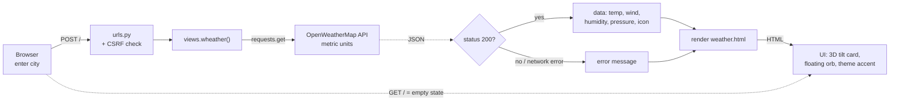

# Wheather-API

A minimal Django weather app. Search any city and get the current conditions from the [OpenWeatherMap](https://openweathermap.org/) API, shown on a 3D-tilting card.

## Features

- Current temperature (°C), feels-like, daily high/low
- Humidity, wind (km/h), pressure and coordinates
- Minimal light/dark theme; the accent colour changes with the weather (clear, rain, snow, clouds)
- 3D effects: a card that tilts with the mouse and has a light glare, a floating icon orb, a perspective grid floor and a spinning cube on the empty screen
- Friendly error messages for unknown cities or network failures
- Animations turn off when the device has "reduce motion" enabled

## Workflow



An editable version of this diagram is in [`workflow.excalidraw`](workflow.excalidraw). Open it at [excalidraw.com](https://excalidraw.com).

## Project structure

```
wheatherapp/          # Django project (settings, urls)
wheather/
  views.py            # calls OpenWeatherMap and builds the page data
  templates/
    weather.html      # UI: styles, 3D effects and tilt script
manage.py
```

## Getting started

```bash
git clone https://github.com/Praveen23-kk/Wheather-API.git
cd Wheather-API
pip install django requests

# get a free key at https://openweathermap.org/api
export OPENWEATHER_API_KEY=your_key_here        # macOS/Linux
# $env:OPENWEATHER_API_KEY="your_key_here"     # Windows PowerShell

python manage.py runserver
```

Then open http://127.0.0.1:8000/ and search a city.

## Tech stack

Django · Python `requests` · OpenWeatherMap API · HTML/CSS (3D transforms) · vanilla JS
